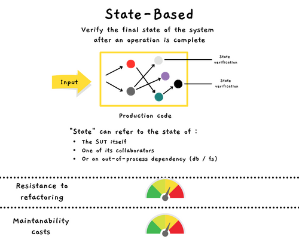
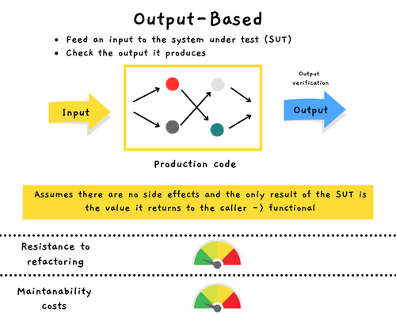
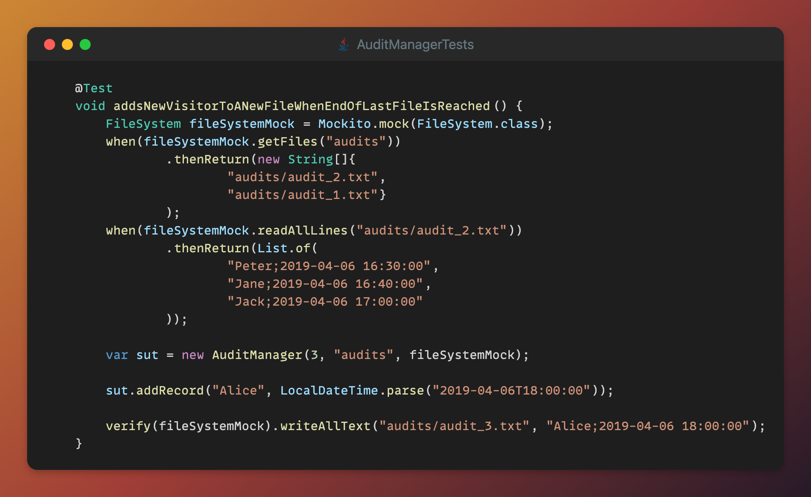

## Day 21: Changing tides.

Today, you are still fighting and while the main storm 
passed you are still not out of danger yet!

You will need to reach the nearby island quickly to recover 
since your ship is badly broken.

Today's exercise is about fixing tests and fixing code.

A refactoring is needed but a first step needs to be made
in the tests.

> **Challenge of day 21: Refactor the tests and production code to Output-Based tests.**

Before refactoring the code, here are some explanations regarding the different kind of tests as explained by Vladimir
Khorikov in his book [Unit Testing Principles, Practices and Patterns.](https://www.manning.com/books/unit-testing).

### Different styles of tests

#### State-Based

```java
class StateBasedTests {
    @Test
    void it_should_add_given_product_to_the_order() {
        val product = new Product("Free Guy");
        val sut = new Order();

        sut.add(product);

        // Verify the state
        assertThat(sut.getProducts())
                .hasSize(1)
                .allMatch(item -> item.equals(product));
    }

    @AllArgsConstructor
    class Product {
        private final String name;
    }

    class Order {
        private final List<Product> products = new ArrayList<>();

        List<Product> getProducts() {
            return Collections.unmodifiableList(products);
        }

        void add(Product product) {
            products.add(product);
        }
    }
}
```



#### Output-Based

```java
class OutputBasedTests {
    @Test
    void discount_of_2_products_should_be_2_percent() {
        val product1 = new Product("Kaamelott");
        val product2 = new Product("Free Guy");

        // Call on the SUT (here PriceEngine)
        // No side effects -> Pure function
        val discount = PriceEngine.calculateDiscount(product1, product2);

        assertThat(discount).isEqualTo(0.02);
    }
}
```



#### Communication-Based

```java
class CommunicationBasedTests {
    @Test
    void greet_a_user_should_send_an_email_to_it() {
        final var email = "john.doe@email.com";
        final var emailGatewayMock = mock(EmailGateway.class);
        // Substitute collaborators with Test Double
        final var sut = new Controller(emailGatewayMock);

        sut.greetUser(email);

        // Verify that the SUT calls those collaborators correctly
        verify(emailGatewayMock, times(1)).sendGreetingsEmail(email);
    }

    interface EmailGateway {
        Try<String> sendGreetingsEmail(String email);
    }

    @AllArgsConstructor
    class Controller {
        private final EmailGateway emailGateway;

        public Try<String> greetUser(String email) {
            return emailGateway.sendGreetingsEmail(email);
        }
    }
}
```



